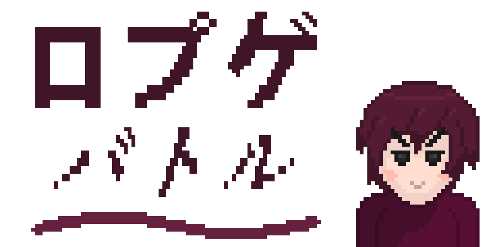

# ⚔️ ROPUGE BATORU

> *A terminal based RPG made in Python!*

## 🛠️ Features

The goal is to get the highest score possible. When you launch the game, you first have to choose your starting character, who needs to survive as many waves of enemies as possible. If he gets enough XP, he'll level up and get an upgrade on one of his statistic. If his level is a multiple of 5, you'll be able to add another character on your team. The more wave, the stronger the enemies get, and if you are good enough, you will be able to fight Neramawa at wave 100!

## 📄 License

Everything is explained in [LICENSE](./LICENSE).